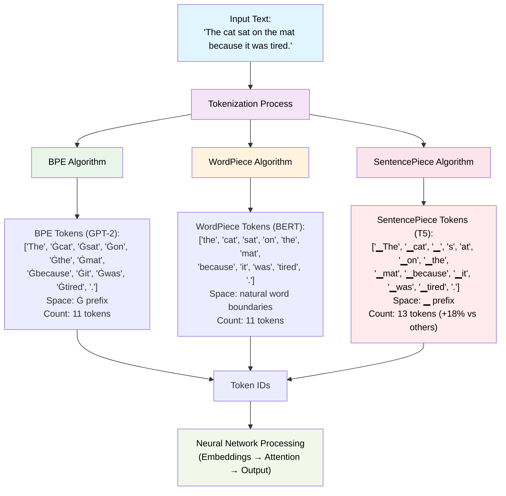

# Why Tokenization Is the Hidden Engine of LLMs

When you type a question into ChatGPT, Claude, or any modern AI assistant, something remarkable happens in the milliseconds before you receive an answer. Your human language undergoes a critical transformation that most users never see or think about – it gets converted into mathematical representations through a process called **tokenization**.

This invisible step isn't just preprocessing; it's the foundation that determines everything from how fast your AI responds to how much you pay for that response. Tokenization is the hidden engine that makes modern AI conversation possible, yet it remains one of the most underappreciated components of artificial intelligence.

## The Mathematical Foundation of AI Understanding

Here's a mind-bending reality: Large Language Models don't actually "read" text the way humans do. When GPT-4 appears to understand your question, it's performing complex mathematical operations on numerical representations. Without tokenization serving as the translation layer, asking an AI to write poetry or solve problems would be like trying to perform calculus with alphabet soup – the fundamental mathematical substrate simply wouldn't exist.

Think of tokenization as the Rosetta Stone between human expression and machine comprehension. Every word you type gets broken down into tokens – which might be whole words, parts of words, or even punctuation marks – and each token receives a unique numerical identifier. These numbers become vectors that neural networks can manipulate, enabling the mathematical magic we perceive as intelligence.

This means when ChatGPT demonstrates "reasoning," it's actually performing matrix operations on sequences of token embeddings. When it translates between languages, it's finding patterns in how different tokenization schemes represent similar concepts across linguistic boundaries.

## The Three Engines Powering Modern AI

Different AI systems use distinct tokenization strategies, each with profound implications for performance and capabilities:

### BPE (Byte Pair Encoding): The Efficiency Master
Used by GPT models, BPE treats text like a compression algorithm, starting with individual characters and iteratively merging the most frequent pairs. This approach makes BPE incredibly efficient at handling vocabulary and exceptional at dealing with rare or newly invented words.

**Why it revolutionized AI**: BPE's efficiency enables GPT models to generate coherent text at unprecedented scale. Its ability to break unknown words into learnable subparts means the model rarely encounters truly "unknown" text – a crucial factor in GPT's impressive generalization abilities.

### WordPiece: The Linguistic Intuition Engine
Developed by Google for BERT, WordPiece incorporates deep linguistic knowledge, preferentially creating tokens that align with morphological boundaries – the natural breakpoints where meaning changes in language.

**Why it matters for understanding**: WordPiece's linguistic awareness is crucial for tasks requiring nuanced language comprehension. It helps models grasp relationships between "run," "running," and "runner" in ways that pure statistical approaches might miss.

### SentencePiece: The Universal Translator
Created for multilingual applications, SentencePiece makes no assumptions about input language, handling any script or writing system without modification.

**Why it enables global AI**: SentencePiece is the reason we have AI models that seamlessly switch between English, Chinese, Arabic, and dozens of other languages. Without it, truly multilingual AI would be impossible.

## The Economics of Every Conversation

Here's something that might surprise you: when you pay for GPT-4 or Claude, you're not paying per word or per question – you're paying per token. This isn't arbitrary; it reflects the fundamental reality that every aspect of AI operation scales directly with token count.

**Your Conversation Costs**: Every token in your prompt and every token in the AI's response costs computational resources. Our analysis shows that different tokenization methods can produce 13 tokens versus 11 tokens for the same sentence – an 18% difference that translates to real money at scale.

**Why Token Limits Matter**: When ChatGPT tells you it's reached its context limit, it's actually hit a token limit, not a word limit. More efficient tokenization means you can fit more meaningful content within that constraint, leading to better conversations.

**Training Economics**: Training GPT-4 reportedly cost over $100 million, with computational requirements directly proportional to tokens processed. A 10-20% improvement in tokenization efficiency could save tens of millions in training costs.

## The Invisible Biases Shaping AI Behavior

Tokenization introduces subtle but profound biases that affect every AI interaction:

**Language Inequality**: English words typically require fewer tokens than equivalent words in other languages, giving English a computational advantage. This can lead to better AI performance on English tasks simply due to tokenization efficiency, not inherent language capabilities.

**Cultural Representation**: Names, places, and concepts from non-Western cultures may be over-tokenized, potentially degrading AI performance when discussing diverse topics.

**Professional Domains**: Medical terminology, legal jargon, and technical vocabulary face varying tokenization efficiency, directly impacting AI competence in specialized fields.

**Code Generation**: Programming languages have specific syntax patterns that different tokenizers handle with dramatically different success rates, explaining why some AI models excel at coding while others struggle.

## How Tokenization Shapes AI Capabilities

The ripple effects of tokenization decisions permeate every aspect of AI behavior:

**Reasoning Chains**: An AI's ability to follow logical sequences depends partly on how tokenization preserves semantic relationships between connected concepts.

**Creative Expression**: Whether an AI can craft wordplay, maintain poetic rhythm, or create puns is constrained by how tokenization segments linguistic elements.

**Mathematical Understanding**: Numbers and equations are particularly sensitive to tokenization choices, directly affecting computational reasoning abilities.

**Cross-Lingual Transfer**: An AI's capacity to apply knowledge learned in one language to another hinges on how tokenization represents shared concepts across linguistic boundaries.

## The Future: Beyond Text Tokenization

As AI evolves beyond text, tokenization principles are expanding into new domains:

**Visual AI**: Vision Transformers treat image patches as "visual tokens," applying the same mathematical principles to computer vision tasks.

**Audio Intelligence**: Speech recognition and generation require converting sound waves into discrete tokens that neural networks can process.

**Multimodal Integration**: The next generation of AI systems must align tokenization across text, images, audio, and video to enable truly integrated understanding.

**Dynamic Tokenization**: Researchers are exploring adaptive tokenization that changes based on context, potentially revolutionizing AI efficiency and capability.

## The Invisible Revolution

Tokenization represents one of AI's most elegant engineering solutions – transforming the infinite complexity of human language into the precise mathematical operations that computers excel at. Yet most users remain unaware of this critical translation happening thousands of times in every conversation.

Understanding tokenization reveals why some prompts work better than others, why AI costs are structured as they are, and why certain tasks challenge even the most advanced models. It's the hidden engine that enables machines to engage with human language in increasingly natural and sophisticated ways.

As we stand on the brink of even more capable AI systems, the next breakthroughs may come not from building larger models, but from developing smarter tokenization methods that bridge human expression and machine understanding more effectively than ever before.

*Next time you chat with an AI, remember: behind every response lies the intricate mathematics of tokenization, quietly orchestrating the conversation between human creativity and artificial intelligence.* 
